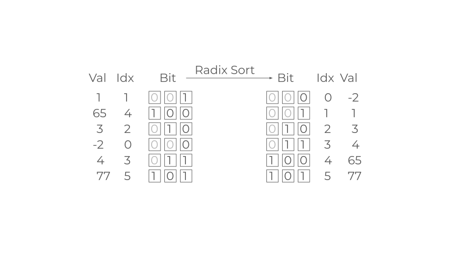
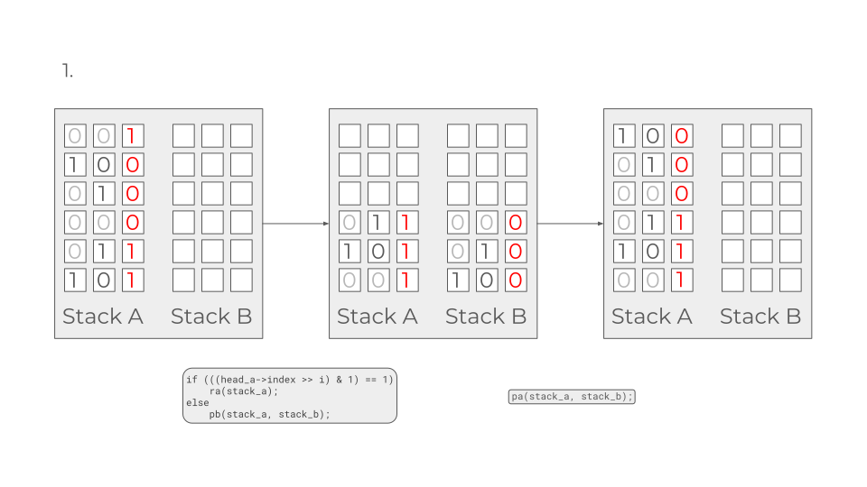
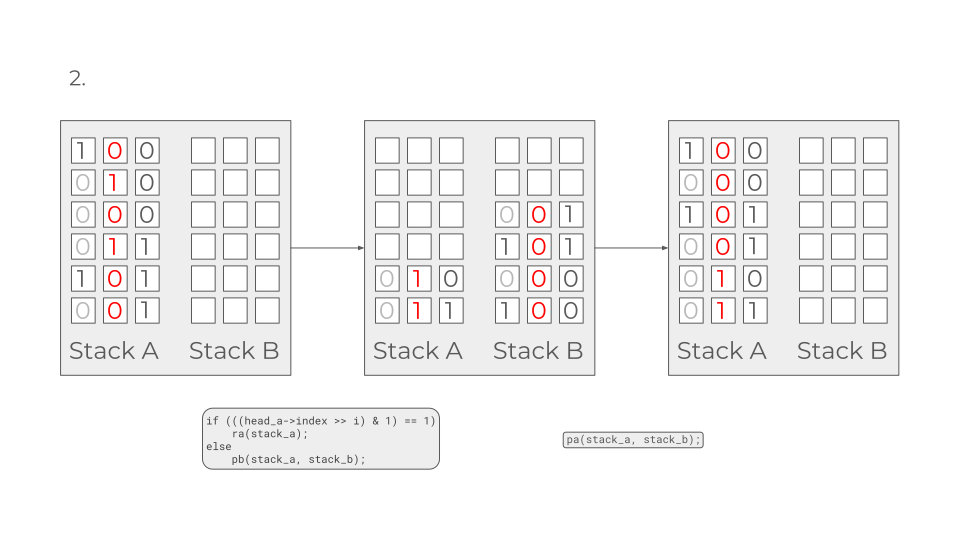
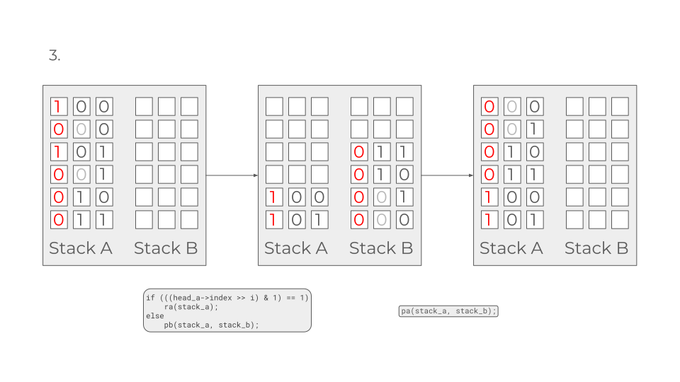

# Push Swap

## Thoughts
One of the most difficult project. Struggled with this one for around 2 months, maybe more. Couldn't understand a single thing the first time around, and I pushed back and procrastinate until the blackhole was looming around the corner. Found quite a number of interesting repos though, different approaches in implementing the creation of the stack. I ended up trying to use the easiest one, a singly linked list, because that is easier to follow. And the algorithm is simply radix, because no calculation is involved (don't have to care about the most efficient cost of movement or whatever). Unfortunately, radix is very inefficient, only uses pa, pb, and ra. But good enough to pass I guess. No bonus, because radix sort is not going to give a perfect score anyway.

~~Patching the leaks was troublesome though. As it is in every case of leaks. The reachable bytes due to using ft_split on arg_check when invalid args are given still can't be fixed. I have no idea how to. But the fact that valgrind does not categorize this as an error consoles me a bit. One of the evaluators said to go take a look and check the performance of ft_split on francinette --strict. Maybe I'll go back to it one day in the future.~~ Done, pretty simple really. Should have done this before the eval. Well, hindsight is 20/20 I guess.

## Organization
1. All files in ./src
2. Organized in this manner

| Main and header	| Algorithm			 		| Operations 				| Utilities 			|
|-------------------|---------------------------|---------------------------|-----------------------|
| push_swap.c 		| algo_simplesort.c 		| operations_push.c 		| utils_check.c 		|
| push_swap.h 		| algo_simplesort_sort3.c	| operations_rotate.c 		| utils_free+print.c	|
| 				 	| algo_radixsort.c 			| operations_rotaterev.c	| utils_index.c 		|
| 				 	| 							| operations_swap.c			| utils_list.c 			|

## Slides





## Functions and Flow
### Main and Stack Initialization
1. ▶️main & ft_argcheck◀️ The `main` function in push_swap.c first checks for valid arguments by calling `ft_argcheck` in utils_checks.c. This function is responsible for splitting the input to args if necessary by using `ft_split` (from libft). Then it checks if the args are all valid numbers (`ft_isnbr`), if not, then error are printed by the function `ft_prt_err` in utils_free+print.c. Duplicates are checked with `ft_isdupli`. If `ft_split` is utilized, then due to memory allocation, <kbd>args</kbd> has to be freed.
2. ▶️main◀️ Then the <kbd>stacks a & b</kbd> are allocated by malloc. The stacks' structure are declared in the header file, which is a singly linked list that contains an <kbd>index</kbd> (to determine the most efficient sequence of operations to sort the stack - e.g., if an element is far from its correct position in the sorted stack (i.e., its index is far from its value), it might be more efficient to use a series of rotates or reverse rotates to move it to its correct position, rather than using a series of pushes and swaps.), a <kbd>value</kbd>, and a <kbd>pointer</kbd> to the next node. <kbd>stack a</kbd> is initialized by the function `stack_init` in push_swap.c.
	```c
	typedef struct s_stack
	{
		int				value;
		int				index;
		struct s_stack	*next;
	}	t_stack;
	```
3. ▶️stack_init◀️ The declared variable <kbd>args</kbd> contains all the arguments. The loop creates a new node by calling the function `ft_lst_newnode` (in utils_list.c) and adds it to the back of the stack by the using the function `ft_lst_nodeback`.
	```c
	while (args[i])
		{
			new = ft_lst_newnode(ft_atoi(args[i]));
			ft_lst_node2back(stack, new);
			i++;
		}
	```
	- The `ft_lst_newnode` function adds the value to the newly created node, assigns the <kbd>index</kbd> value at -1 (sentinel value, real value will be set by the function `stack_indexing`) and set the <kbd>next</kbd> pointer of the stack to NULL. The `ft_lst_node2back` checks if the stack is empty or not. If it is empty, it makes the <kbd>new_node</kbd> as the first node. If it is not empty, then it calls the `ft_lst_pointer2last` to get the pointer to the last node in the stack. Then the `ft_lst_node2back` sets the <kbd>next</kbd> field of the last node in the stack to the <kbd>new_node</kbd>, and the <kbd>next</kbd> field of the <kbd>new_node</kbd> to NULL.
4. ▶️stack_indexing◀️ Then after the stack has been populated by the values, the function `stack_indexing` (in utils_index.c) assigns the proper indexes. This function relies on the function `lowest_val` which finds the node with the smallest value in a stack that has not been indexed. The `lowest_val` function loops to check each node. If the <kbd>index</kbd> of a node is -1 and do not have the <kbd>flag</kbd>, then it is at position 1. The flag is then set to 1 and updates <kbd>min</kbd> to the current node. The next node is then checked if not yet indexed (-1), and checked if the <kbd>value</kbd> is less then the previous node. After the loop, the function returns the min pointer, which points to the node with the minimum value.
Basically, if the array is {3, 1, 2, 4}, the index would be 2, 0, 1, 3, respectively.
5. ▶️main◀️ Then after the stack (linked list) is created, the main function makes a preliminary check (`is_sorted`) if the <kbd>values</kbd> are already sorted, if yes return zero and free the <kbd>stacks a & b</kbd>. If not, then it calls the function `sort_stack`.
6. ▶️sort_stack◀️ The `sort_stack` function checks the size of <kbd>stack a</kbd> (by `ft_list_size`) and calls the corresponding sorting algo. If size < 5, then use `simple_sort`, if more, then `radix_sort` (both in its respective algo_*.c files).
	```c
	if (ft_list_size(*stack_a) <= 5)
		simple_sort(stack_a, stack_b);
	else
		radix_sort(stack_a, stack_b);
	```

### Algorithms
#### Simple sort
1. ▶️simple_sort◀️ For values amounting up to 5, the algo is in this simple_sort algo.
2. ▶️simple_sort◀️ The first thing done here is a control sequence to check if the input values (or the values in the stack) are already sorted, or there is either no value given or just one value. If any of these is true, then nothing is returned. If not, then proceed to get the size of the stack/length of the value array. The consequent steps depends on the size.
	- If there are only 2 values, then there is only one operation to be done, namely swapping the values using `sa`.
	```c
	if (size == 2)
		sa(stack_a);
	```
	- If size is 3 or more, then go to the corresponding functions.
	```c
	else if (size == 3)
		sort_3(stack_a);
	else if (size == 4)
		sort_4(stack_a, stack_b);
	else if (size == 5)
		sort_5(stack_a, stack_b);
	```
3. ▶️sort_3◀️ The sort_3 function is in algo_simplesort_sort3.c due to first exceeding the number of lines for a fucntion. Then it is separated to different functions but exceeds the number of function in a file. Lovely.
	- To sort 3, `stack b` is not used. 
	- This function sorts a stack of three elements by performing rotate, swap, and reverse rotate operations based on the relative values of the index of the head and the next node in the stack.
	- The way the function does this is by using the `min_idx` function that takes a stack and a value.
	```c
	int	min_idx(t_stack **stack, int val)
	{
		t_stack	*head;
		int		minidx;

		head = *stack;
		minidx = head->index;
		while (head->next)
		{
			head = head->next;
			if ((head->index < minidx) && head->index != val)
				minidx = head->index;
		}
		return (minidx);
	}
	```
	The first call of `min_idx` uses <kbd>val</kbd> = -1. This guarantees getting the node with the lowest index (0). This is stored in <kbd>minidx</kbd>.
	```c
	minidx = min_idx(stack_a, -1);
	```
	- The next call increments the val that gets passed to the `min_idx` function by using <kbd>minidx</kbd>, and the return of the function is stored in <kbd>next_minidx</kbd>.
	```c
	next_minidx = min_idx(stack_a, minidx);
	```
	- If there are 3 sorted value, then <kbd>minidx</kbd> and <kbd>next_minidx</kbd> will always be 0 and 1 respectively. However the `sort_3` function is called by the subsequent sorting function (namely `sort_4`), at which point <kbd>minidx</kbd> and <kbd>next_minidx</kbd> may have different result.
4. ▶️sort_4◀️ In this function some conditionals are declared according to a measure <kbd>distance</kbd> 
	```c
	distance = get_distance(stack_a, min_idx(stack_a, -1));
	```
	that describes how far the node with the lowest idx is from the head of a stack and perform operation(s) to bring it to the first position. 
	```c
	if (distance == 1)
		ra(stack_a);
	else if (distance == 2)
	{
		ra(stack_a);
		ra(stack_a);
	}
	else if (distance == 3)
		rra(stack_a);
	```
	Then push that node to <kbd>stack_b</kbd>, 
	```c
	pb(stack_a, stack_b);
	```
	and the rest of the nodes (<kbd>values</kbd>) in the stack are sorted by `sort_3`.
	```c
	sort_3(stack_a);
	```
	and push back the node in <kbd>stack b</kbd> to <kbd>a</kbd>.
	```c
	pa(stack_a, stack_b);
	```
5. ▶️sort_5◀️ Same with `sort_4`. 

#### Radix sort
1. ▶️radix_sort◀️ Radix sort is used to sort > 5 numbers. Works by sorting the <kbd>index</kbd> of each node according to its bit representation. This is done because radix sorting on the value itself may run to problems if the value is negative. It iterates through each bit position of the maximum number in the stack (<kbd>max_bits</kbd>), performing sorting based on those bits. 
2. This algo is very inefficient. In fact it operates only on </kbd>stack a</kbd>, and operations like `sb`, `rb`, etc were not utilized at all. Had to do it this way because I am desperate. 
3. ▶️find_max_bits◀️ <kbd>max_bits</kbd> is obtained through the function `find_max_bits` where the <kbd>max</kbd> is the <kbd>index</kbd> of a node. In the loop iterating the stack, <kbd>max</kbd> is updated with bigger <kbd>index</kbd> value.
	```c
	while (head)
	{
		if (head->index > max)
			max = head->index;
		head = head->next;
	}
	```
4. The bit value of <kbd>max</kbd> is then shifted by <kbd>max_bits</kbd> (which was initialized as 0) in a loop for however many times until it is zero. That would be the maximum number of bits.
	```c
	while ((max >> max_bits) != 0)
		max_bits++;
	```
5. ▶️radix_sort◀️ The function has a nested while loop. The outer loop increments <kbd>i</kbd> until equal to <kbd>max_bits</kbd>, and the inner loop increments <kbd>j</kbd> until equal to <kbd>size</kbd>. In the inner loop, the function checks the <kbd>i</kbd>-th bit of the <kbd>index</kbd> of the head of stack_a. If this bit is 1, it does the `ra` function. If this bit is 0, it pushes the head of stack_a to stack_b using `pb`.Then another while loop to empty stack_b by `pa`. And so on
	```c
	while (i < max_bits)
	{
		j = 0;
		while (j++ < size)
		{
			head_a = *stack_a;
			if (((head_a->index >> i) & 1) == 1)
				ra(stack_a);
			else
				pb(stack_a, stack_b);
		}
		while (ft_list_size(*stack_b) != 0)
			pa(stack_a, stack_b);
		i++;
	}
	```
.
### Operations
#### Push
1. ▶️push◀️The push function initializes temporary pointers <kbd>head_to</kbd> and <kbd>head_from</kbd> to the respective heads of <kbd>stack_to</kbd> and <kbd>stack_from</kbd>, and assigns <kbd>tmp</kbd> as <kbd>head_from</kbd> and the next element of <kbd>stack_from</kbd> to <kbd>head_from</kbd>. It updates <kbd>stack_from</kbd> to point to <kbd>head_from</kbd>, removing the first element from <kbd>stack_from</kbd>.
	```c
	head_to = *stack_to;
	head_from = *stack_from;
	tmp = head_from;
	head_from = head_from->next;
	*stack_from = head_from;
	```
2. If <kbd>stack_to</kbd> is initially empty (<kbd>head_to</kbd> is NULL), <kbd>tmp</kbd> becomes the new head of <kbd>stack_to</kbd>, and its next pointer is set to NULL (end of stack). If <kbd>stack_to</kbd> is not empty, <kbd>tmp</kbd> is inserted at the beginning of the stack by setting its next pointer to the previous head of <kbd>stack_to</kbd>, and <kbd>tmp</kbd> becomes the new head of <kbd>stack_to</kbd>. Then the pointer <kbd>stack_to</kbd> is updated to point to the new head of <kbd>stack_to</kbd>.
	```c
	if (!head_to)
	{
		head_to = tmp;
		head_to->next = NULL;
		*stack_to = head_to;
	}
	else
	{
		tmp->next = head_to;
		*stack_to = tmp;
	}
	```
3. `pa` and `pb` are just calling the push function with the reverse of the stacks.

#### Swap
Similar structure with push.

#### Rotate
Similar structure with push and swap, but `rr` does both operations at the same time.

#### Reverse rotate
Similar with rotate.

### Utilities
#### Arg checker
1. Checks if the arguments are given in a string (e.g. ./a.out "1 2 3"). If yes, then split with `ft_split`.
	```c
	if (argc == 2)
		args = ft_split(argv[1], ' ');
	```
2. If not then assign all <kbd>argv</kbd> to the array <kbd>args</kbd>.
3. Then check all <kbd>args</kbd> one-by-one whether:
	- it is a valid number
		```c
		if (!ft_isnbr(args[i]))
		```
	- it has no duplicate
		```c
		if (ft_isduplicate(tmp, args, i))
		```
	- beyond int
		```c
		if (tmp < -2147483648 || tmp > 2147483647)
		```
4. Error message is printed by `ft_prt_err` to fd 2 and exits.
5. If `ft_split` is called, then explicit `free` is required, contained in `free_args`.
	```c
	if (argc == 2)
		free_args(args);
	```

#### Freeing and printing
1. Contains functions to free:
	- array of arguments (`free_args`)
	- stack (`free_stack`)
2. And printing error message (`ft_prt_err`) via `ft_putendl_fd` to STDERR and exit the program.

#### Indexing
1. ▶️stack_indexing◀️ This function assigns an index to a node, incrementing it each by 1, starting from 0 for the lowest value node in the stack.
	```c
	idx = 0;
	head = min_val(stack);
	while (head)
	{
		head->index = idx;
		idx++;
		head = min_val(stack);
	}
	```
2. ▶️find_minval◀️ This function finds the lowest value node that **has not** been indexed yet (<kbd>idx</kbd> = -1) and returns the pointer of that node.

#### Linked list
1. ▶️ft_lst_newnode◀️ Creates a node with a certain <kbd>value</kbd> by first malloc-ing a node the size of a t_stack node (so has to be freed). Then assigning the <kbd>new_node->value</kbd> by the <kbd>value</kbd> input argument, initialize <kbd>new_node->index</kbd> as -1, and provide the pointer to the next node <kbd>new_node->next</kbd> as NULL. Returns the (pointer to the) node.
	```c
	new_node->value = value;
	new_node->index = -1;
	new_node->next = NULL;
	return (new_node);
	```
2. ▶️ft_lst_pointer2last◀️ Gets a pointer to the last node in a stack. Iterates every node until the value of <kbd>ptr->next</kbd> is NULL (this means the end of the linked list/stack), and returns it.
	```c
	while (ptr->next)
	{
		ptr = ptr->next;
		if (ptr->next == NULL)
			return (ptr);
	}
	return (ptr);
	```
3. ▶️ft_lst_node2back◀️ Adds a node to the end of a stack. It is done by first getting the pointer of the last node (by `ft_lst_pointer2last`), then modify the pointer on that node to the about-to-be-added node.
	```c
	ptr = ft_lst_pointer2last(*stack);
	ptr->next = new_node;
	```
4. ▶️ft_list_size◀️ Copied from my exam exercise with additional lines to control against 0 size. Just increment a counter while looping over the stack (<kbd>head->next</kbd>). The counter starts **not** from 0, but 1. 

### Checker - bonus ?
- Nope, not going to do this.

## Remarks
- The radix algorithm to sort numbers seems very inefficient. One of the reason for this is because basically sorting is done on whatever numbers is left on one stack, and the other stack is just being used as bucket/stash to store. This is evident in the operations that are used in the whole algo are basically just rotations in stack a, and pushing back and forth between stack b and a.
- There are ideas that I found that could potentially optimise the working of the radix sorting algorithm, however it does not seem enough to significantly improve the performance (i.e. negligible improvement), hence not done.
- This algo would not achieve necessary score requirement to do the bonus checker, so I skip it.
- A (much) better approach I have found is by foregoing the linked list entirely and save a lot of headache, and simply store the values in an int array variable within a struct (designated as stack a), and declare another int variable that describes the size of the array (look for akalimol/akadil). 
	- The sorting itself is done via bubble sorting.
	- First get the median of stack a (obtained via quick sorting a dummy stack a) and push everything lower than that to b. Repeat until 3 largest number left in a, and sort them.
	- Then associate a cost for the operations of each number in b to be put in a.
- I am not sure at this point what to return in the malloc protection in main, because returning NULL in a function that expects an int return does not work. Maybe return (0)? Or just exit (0)? Or exit (1)? What is the difference here?

## Verifications
- `https://github.com/o-reo/push_swap_visualizer`
- `https://github.com/gemartin99/Push-Swap-Tester`
- `valgrind --leak-check=full --show-leak-kinds=all ./push_swap "4 6 3u"` ~~(reachable bytes?)~~ -> fixed
- ~~`curl https://raw.githubusercontent.com/hu8813/tester_push_swap/main/pstester.py | python3 -`~~ -> weird

## To do
- leaks?
	```
	valgrind --leak-check=full \
         --show-leak-kinds=all \
         --track-origins=yes \
         --verbose \
         --log-file=valgrind-out.txt \
         ./executable exampleParam1
	```
